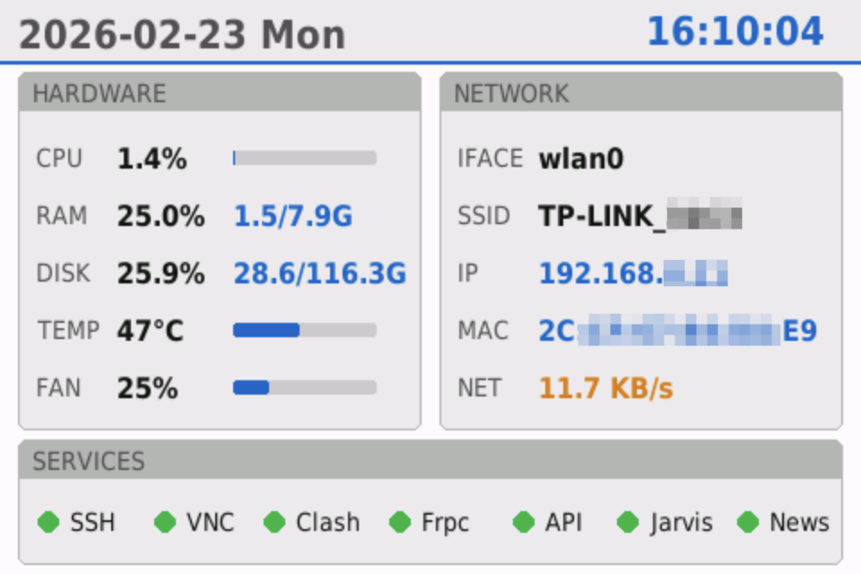

# RaspberryMonitor

A lightweight Raspberry Pi system monitor dashboard built with **pygame**.

It displays:
- **Hardware**: CPU / RAM / Disk / Temperature / Fan
- **Network**: interface, SSID, IP, MAC, realtime throughput
- **Services**: systemd service status indicators

Designed for small screens (default **480x320**) and can run fullscreen.

## Features

- Simple UI optimized for small TFT / HDMI displays
- Theme auto-switch (light/dark)
- Low-frequency service checks (default 15s) to reduce overhead
- Works well as a **user-level systemd service**

## Requirements

- Python 3
- pygame
- psutil

Install deps (example):

```bash
python3 -m venv env
source env/bin/activate
pip install pygame psutil
```

## Screenshot



## Usage

Run directly:

```bash
python3 monitor.py
```

Exit with **ESC**.

## systemd (user service)

Example unit:

```ini
[Unit]
Description=Raspberry Pi System Monitor Dashboard
After=graphical-session.target

[Service]
ExecStartPre=/bin/sleep 10
ExecStart=/usr/bin/python3 /path/to/monitor.py
Restart=always
RestartSec=2

[Install]
WantedBy=default.target
```

Reload + start:

```bash
systemctl --user daemon-reload
systemctl --user enable --now monitor.service
```

## Configuration

Edit the constants at the top of `monitor.py`:

- `SCREEN_WIDTH`, `SCREEN_HEIGHT`
- `MONITORED_SERVICES`
- `DATA_UPDATE_INTERVAL`, `SERVICE_CHECK_INTERVAL`

## Notes

- Wi-Fi SSID detection uses `iwgetid` when interface starts with `wlan`.
- Temperature reads from `/sys/class/thermal/thermal_zone0/temp`.
- Fan speed reads from `/sys/class/thermal/cooling_device0/*` when available.

## License

MIT
